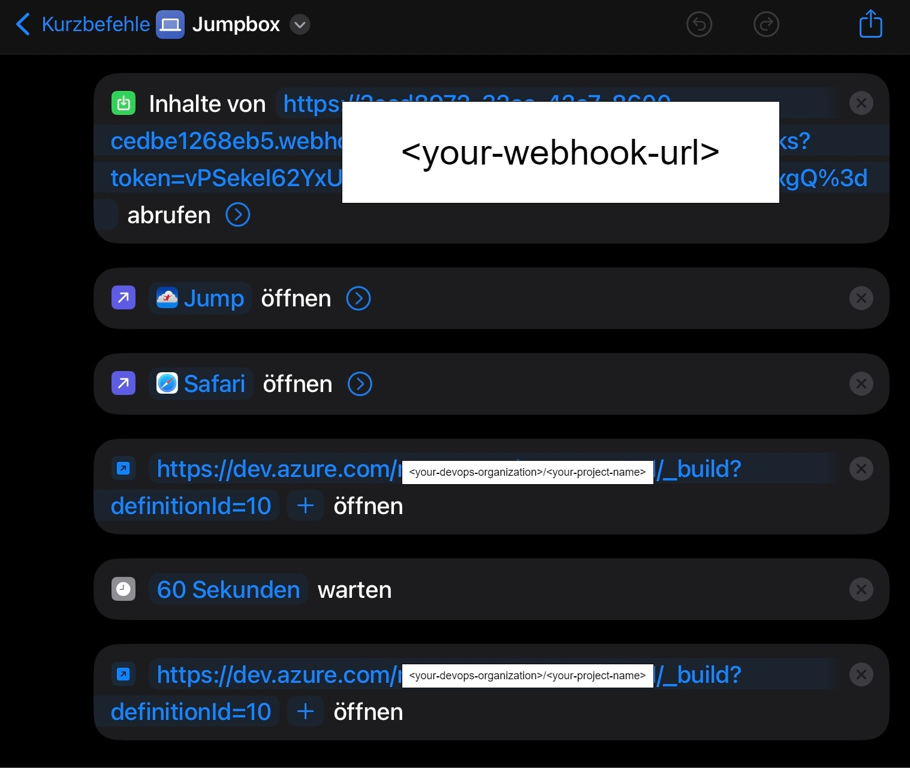

# WindowsFromTheCloud
A cloud pc on my iPad, spinning up with the touch of a button.

# Goal
I want my iPad to replace my private laptop. As I don't often need a private laptop and when only for 
 1. browsing the web
 2. playing games

I thought it cheaper to spin up a vm in Azure on a pay-per-use basis.

# Prerequisites
- An Azure account with an active Subscription for Infrastructure
- An Azure DevOps account for pipeline deployment
- An iPad as client and to run a shortcut to start the VM
- A client device to run [Parsec](https://parsec.app/downloads) for low latency game streaming

# Setup
## WebVM
## Initial Setup
1. Create a resource group named `webVM.rg`
2. Create a resource group name `snapshot.rg`
3. Create a VM with the configs you want inside the `webVM.rg`
3. Log into the VM via RDP and install [Jump Desktop Connect](https://jumpdesktop.com/connect/)
4. Install Jump Desktop on your iPad and verify that you can connect to your VM.
5. Create a snapshot of the vm inside the `snapshot.rg` resource group.
6. Delete all resources within the `webVM.rg`

## Pipeline Setup
### Service Connection
Create a service connection to your azure subscription for use in the following pipelines.

### Pipelines
There is one pipeline `deployment-pipeline.yml` for starting and deleting the vm.
1. create the start pipeline from the `deployment-pipeline.yml` file with the pipeline variable `templateFileName` 
and value `main.bicep`
2. create the stop/delete pipeline analog with the pipeline variable `delete.bicep`. The `delete.bicep` file is 
just an empty bicep file, the `--mode Complete` ensures the deployment deletes any resource in the `webVM.rg`

If you run the start pipeline your vm should be created and you should be able to connect from your iPad.
Accordingly if you run the stop pipeline all resources should be deleted.

## ipadOS Shortcuts Setup
### Runbooks
The runbooks are executed with a Azure Automation Account.
- You need to create a personal access token with Build - read & execute rights.
- You find the definitionId of your devops pipeline in the URL in your browser if you have the pipeline open.

### Setup
1. Create a resource group `automation-rg` 
2. Create a Azure Automation Account
3. Create two runbooks with the provided `.ps1` files.
4. Create a webhook for each runbook.
5. Crate a action group that runs the shutdown runbook upon alert
6. Create two iOS shortcuts:

## Auto-shutdown after 1 hour
### Goal
To further save costs, the deployed vm should shutdown itself after 1 hour. In case a shutdown is detected by a existing 
action group, a runbook is executed that triggers the delete pipeline.

The action group is refernced in the vm deployment `main.bicep`

So after one hour the vm basically self-destroys.

## Gaming VM (GPU)